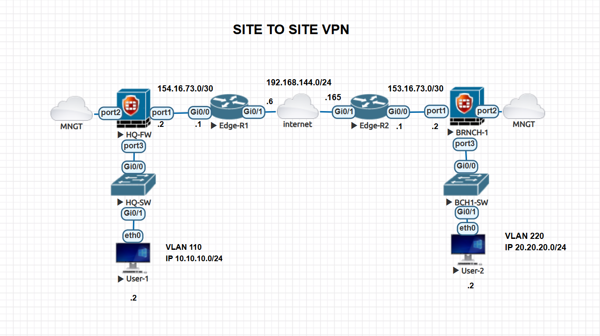
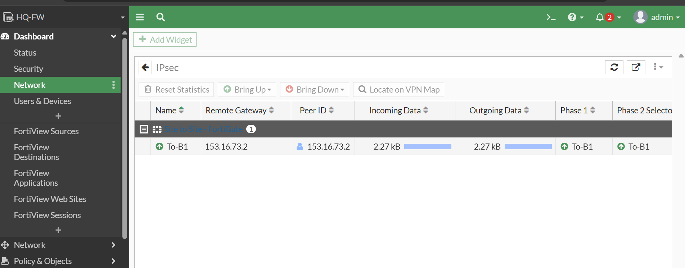
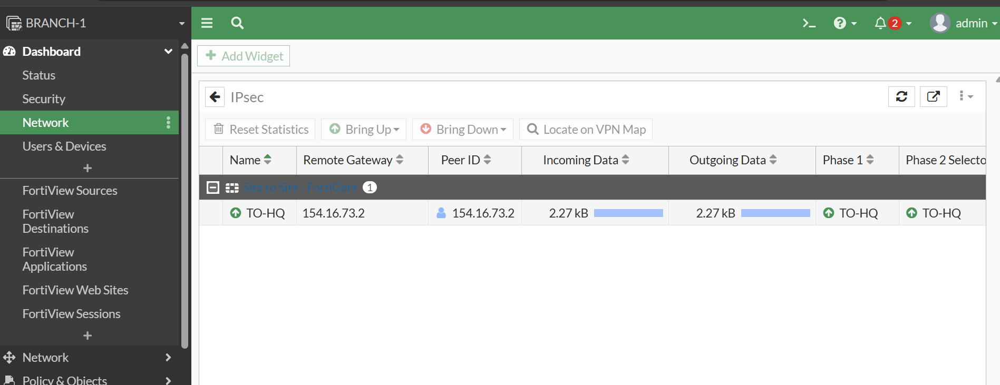
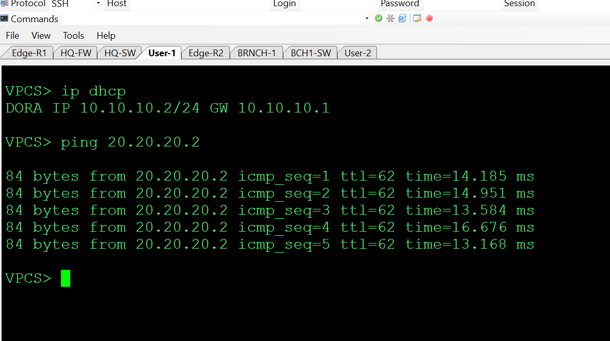
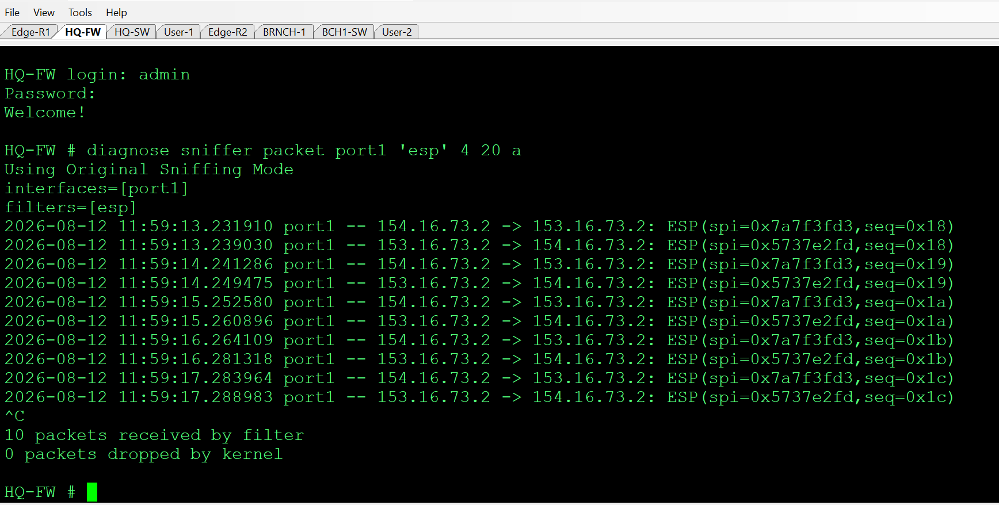

# FortiGate Site-to-Site IPsec VPN Lab

> A hands-on enterprise VPN lab demonstrating secure HQ-to-branch connectivity over an untrusted network using FortiGate route-based IPsec, static routing, and packet-level encryption verification.


## Executive Summary

This lab models a common enterprise requirement: securely connect a Headquarters network and a Branch network across an untrusted public-network path.

Two FortiGate firewalls establish a route-based site-to-site IPsec tunnel. Internal traffic is routed through the VPN, while packet capture on the WAN side is used to verify that the payload is protected by IPsec rather than exposed as plaintext.

## Objectives

- Establish a stable FortiGate-to-FortiGate IPsec tunnel.
- Connect separate HQ and Branch LANs through the tunnel.
- Use route-based VPN interfaces with static routing.
- Verify bidirectional end-to-end connectivity.
- Validate encryption at the packet level.
- Document the lab so another engineer can reproduce the design.

## Network Topology



| Site | Device | Role | Interface | Address / Network |
|---|---|---|---|---|
| HQ | HQ-FW | FortiGate | port1 / WAN | 154.16.73.2/30 |
| HQ | HQ-FW | FortiGate | port3 / LAN | VLAN 110 gateway |
| HQ | HQ-SW | L2 switch | Gi0/1 | VLAN 110 |
| HQ | User-1 | End host | VLAN 110 | 10.10.10.0/24 |
| Branch | BRNCH-1 | FortiGate | port1 / WAN | 153.16.73.2/30 |
| Branch | BRNCH-1 | FortiGate | port3 / LAN | VLAN 220 gateway |
| Branch | BCH1-SW | L2 switch | Gi0/1 | VLAN 220 |
| Branch | User-2 | End host | VLAN 220 | 20.20.20.0/24 |
| ISP | Edge-R1 / Edge-R2 | Transit routers | — | 192.168.144.0/24 |

### Traffic Flow

```text
User-1
  │
10.10.10.0/24
  │
HQ-FW ─────── IPsec Tunnel ─────── BRNCH-1
  │              ESP                 │
  └──── simulated ISP transit ───────┘
                                     │
                              20.20.20.0/24
                                     │
                                   User-2
```

## VPN Design

| Parameter | Design |
|---|---|
| VPN type | Route-based site-to-site IPsec |
| Authentication | Pre-shared key |
| HQ peer | 154.16.73.2 |
| Branch peer | 153.16.73.2 |
| HQ LAN | 10.10.10.0/24 |
| Branch LAN | 20.20.20.0/24 |
| Routing | Static routes over VPN interface |
| WAN simulation | Edge-R1 / Edge-R2 |

> The public addresses and credentials in this repository are for the isolated lab only. Never reuse lab secrets in production.

## Configuration

The `Configurations/` directory contains the device configuration material used by the lab.

The implementation follows this sequence:

1. Configure WAN and LAN interfaces.
2. Configure the FortiGate IPsec Phase 1 parameters.
3. Configure Phase 2 selectors for the internal networks.
4. Bind the route-based tunnel interface to the routing design.
5. Add routes for the remote LAN through the VPN.
6. Configure security policies allowing the required HQ-to-Branch and Branch-to-HQ traffic.
7. Verify tunnel establishment and traffic counters.

## Verification & Testing

### 1. Tunnel Establishment

The HQ and Branch screenshots show the IPsec tunnel established and exchanging traffic.





### 2. End-to-End Connectivity

A ping from User-1 (`10.10.10.2`) to User-2 (`20.20.20.2`) verifies that the remote LANs are reachable through the VPN.



### 3. Encryption Verification

A WAN-side capture is used to verify that traffic crossing the simulated public network is carried as IPsec ESP traffic rather than exposing the internal payload directly.



This is an important distinction: seeing ESP confirms IPsec encapsulation on the observed path; it does not by itself prove every possible security property of the overall deployment.

## Troubleshooting Method

When the tunnel is not passing traffic, troubleshoot in layers:

1. **Underlay:** confirm WAN reachability between peers.
2. **IKE:** confirm Phase 1 negotiation.
3. **IPsec:** confirm Phase 2 selectors and SAs.
4. **Routing:** confirm the remote LAN route points to the VPN interface.
5. **Policy:** confirm firewall policies allow the traffic.
6. **Counters:** confirm encrypted/decrypted byte counters increase.
7. **Packet capture:** inspect the WAN and LAN sides to isolate where traffic stops.

Useful FortiGate verification commands include:

```text
diagnose vpn ike gateway list
diagnose vpn tunnel list
diagnose sniffer packet any 'host <peer-ip>' 4 0 l
diagnose debug flow filter addr <remote-host>
diagnose debug flow show function-name enable
diagnose debug enable
```

Use commands appropriate to the FortiOS version installed in the lab.

## Repository Structure

```text
fortigate-site-to-site-ipsec-vpn-lab/
├── Configurations/
├── screenshots/
│   ├── Topology.png
│   ├── HQ.png
│   ├── B1.png
│   ├── Ping.png
│   └── testing_the_encryption.png
└── README.md
```

## Reproduce the Lab

1. Prepare EVE-NG or GNS3.
2. Install compatible FortiGate and Cisco IOS images.
3. Build/import the topology shown above.
4. Configure the WAN transit path.
5. Apply the FortiGate configurations.
6. Establish the IPsec tunnel.
7. Test User-1 → User-2 connectivity.
8. Capture WAN traffic and verify IPsec encapsulation.

Vendor images are intentionally not included in this repository.

## Key Skills Demonstrated

- FortiGate firewall administration
- Route-based IPsec VPN
- IKE/IPsec troubleshooting
- Static routing
- VLAN-based LAN segmentation
- EVE-NG/GNS3 network emulation
- Packet-level security verification
- Network documentation and reproducibility

## Author

**Amiin** — Networking & Security

- GitHub: [@mohamedamiin10](https://github.com/mohamedamiin10)
- LinkedIn: [Mohamed Osman Ali](https://www.linkedin.com/in/mohamed-osman-ali-14a765406/)

---

This repository is an educational lab and should not be treated as a production security baseline without additional hardening, monitoring, redundancy, and vendor-version-specific review.